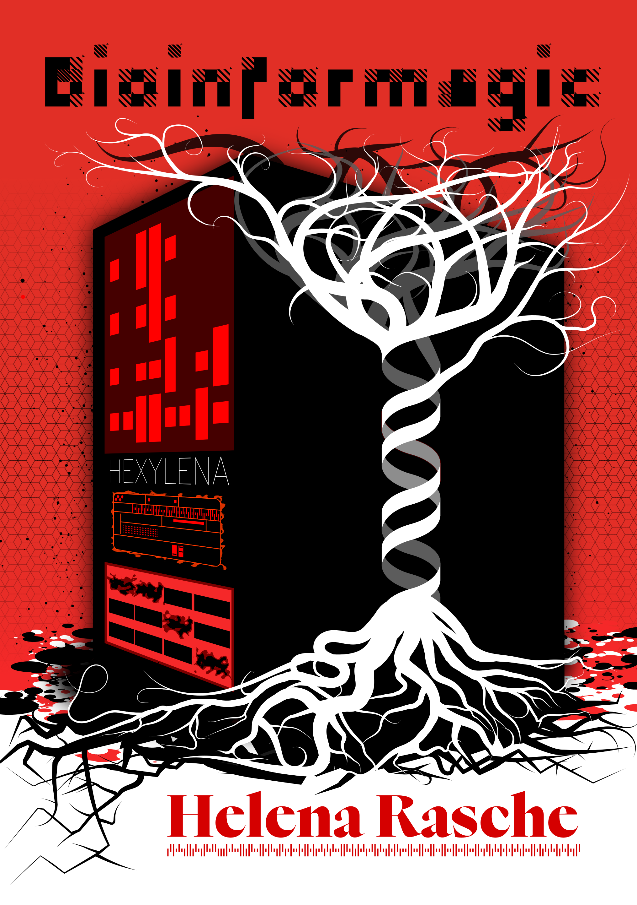

# PhD Thesis

You may read the [final published version at EUR.](https://pure.eur.nl/en/publications/bioinformagic-towards-a-book-of-spells-to-make-every-analysis-mag/)

PhD thesis based on the [dissertate template](https://github.com/suchow/Dissertate), also based on
Saskia Hiltemann's [thesis](https://github.com/shiltemann/thesis/)

### Usage

Run `make thesis` to generate the pdf, `make view` to open pdf in okular, and `make watch` to regenerate the pdf on every change.

### Inspiration

- https://science.anu.edu.au/news-events/news/unexpected-poetry-phd-acknowledgements
- https://www.linyangchen.com/Typography-Fell-Types-font
